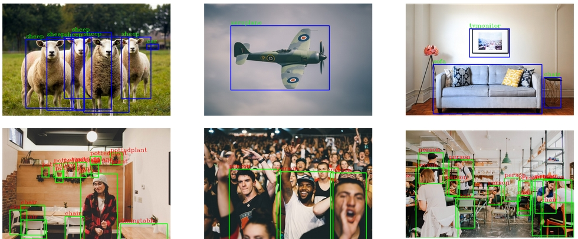

## Faster-rcnn for multiclass object detection.

Before understand implementation it is essential to understand what is Faster-rcnn and RPN (Region Proposal Network) are, so i just add little intoduction of them.

R-cnn and it counterparts were the state-of-the-art object detection algorithms for the longtime until YOLO comes into picture.

In R-cnn paper Ross girshick first introduce the Region Proposal technique. In which he proposed the idea of using selective search algorithm to extract just 2000 regions from the image instead of classify a huge number of region.

**Faster-rcnn :>** Faster-rcnn is the updated version of R-cnn where some of the drawbacks are solved. In which the apparach is similar to r-cnn but instead of feeding 2000 regions we feed input image to CNN to generate feature maps.And from these feature maps we identify region propasals, and by ROI pooling layer we eshape them into a fixed size so that it can be fed into a fully connected layer. From the RoI feature vector, we use a softmax layer to predict the class of the proposed region and also the offset values for the bounding box.

**RPN :>** A **Region Proposal Network**, or RPN, is a fully convolutional network that simultaneously predicts object bounds and objectness scores at each position. The RPN is trained end-to-end to generate high-quality region proposal.RPNs are designed to efficiently predict region proposals with a wide range of scales and aspect ratios. RPNs use anchor boxes that serve as references at multiple scales and aspect ratios. The scheme can be thought of as a pyramid of regression references, which avoids enumerating images or filters of multiple scales or aspect ratios.

 Figure: Faster R-CNN (RPN + Fast R-CNN)

----

Implementation of faster-rcnn:

 
 

For this project i used [PASCAL VOC 2012](https://www.kaggle.com/huanghanchina/pascal-voc-2012) dataset, where we have annotations(metadata of images in the xml file) and sets of images. We have 20 different types of objects to detect where per image can contain [0,20] objects. 

1. First we need to extract metadata from xml files in which we have metadata of `image_id`,`name present object in image`,`bounding box cordinates` and `image path`. inbuilt **xml** module used for extact metadata.

2. Second step is to create dataFrame from extracted values.

 

3. Third step is to convert labels into numerical form by using `sklearn's LabelEncoder` module.

4. forth step is to seperate bounding box coordinated into different columns so we can get values easily.

5. it is essential to make custom pytorch dataset for handling over images and bounding boxes.PyTorch gives you the freedom to pretty much do anything with the Dataset class so long as you override two of the subclass functions:

        * __len__ function which return the size of the dataset,

        * __getitem__ function which returns a sample from the dataset given an index

    I used opencv for reading the image. and make sure to scale the images.

6. For `Augmentation` i used  `albumentation` module, and use  `HorizontalFlip` and  `RandomBrightnessContrast` transformations.

7. i used pre-trained model on `COCO` dataset.

        # load a model; pre-trained on COCO
        model = torchvision.models.detection.fasterrcnn_resnet50_fpn(pretrained=True)
        # get number of input features for the classifier
        in_features = model.roi_heads.box_predictor.cls_score.in_features

        # replace the pre-trained head with a new one
        model.roi_heads.box_predictor = FastRCNNPredictor(in_features, num_classes)

8. Pytorch offers modules for training purposes, which is realy handy and reduces lots of effort and time.

**install them in your project by typing below commands:**

    !pip install -U 'git+https://github.com/cocodataset/cocoapi.git#subdirectory=PythonAPI'

    !git clone https://github.com/pytorch/vision.git

**and then import them:**

    from engine import train_one_epoch, evaluate
    import utils

**Afer training done save the parameters:**

    torch.save(model.state_dict(), 'faster_rcnn_state.pth')

| Dataset  |[PASCAL VOC 2012](https://www.kaggle.com/huanghanchina/pascal-voc-2012)   |
|---------------------------------|------------------------------|
| **machine learning framework**  | **Pytorch  1.8.0 or higher** |

