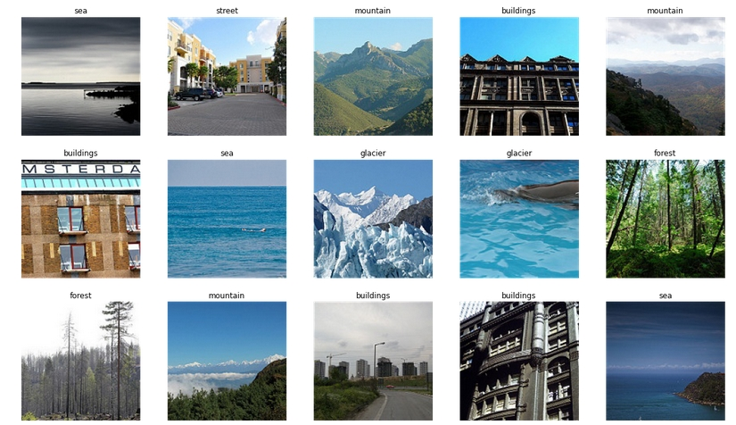
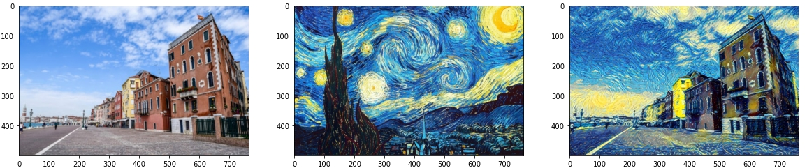
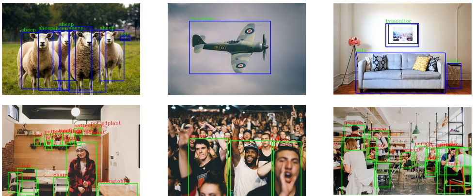

## This repository holds my work on computer vision technology.

## Projects:

### 1. Image classification:

* For this project i used [Intel Image Classification](https://www.kaggle.com/puneet6060/intel-image-classification) dataset, which contains image data divided in 3 sub-folder `seg_pred`,`seg_test` and `seg_train`.

* This 6 class classification project where i have 6 different classes of images that is   `mountain`, `street`,`buildings`, `sea`, `forest`, `glacier`.

* For further explanation please go to project folder and for code implementation visit my [kaggle notebook](https://www.kaggle.com/billiemage/pytorch-use-pretrained-model).

### 2. Style Transfer with Deep Neural Networks.

* This project is based on [Leon A. Gatys’ paper, A Neural Algorithm of Artistic Style](https://arxiv.org/abs/1508.06576).

* Neural style transfer is an optimization technique used to take three images, a content image, a style reference image (such as an artwork by a famous painter), and the input image you want to style — and blend them together such that the input image is transformed to look like the content image, but “painted” in the style of the style image.

* For detailed explanation please visit my [kaggle notebook](https://www.kaggle.com/billiemage/style-transfer-with-deep-neural-networks).

## 3. Faster-rcnn for multiclass object detection.

* R-cnn and it counterparts were the state-of-the-art object detection algorithms for the longtime until `YOLO` comes into picture.

* In R-cnn paper **Ross girshick** first introduce the `Region Proposal` technique. In which he proposed the idea of using selective search algorithm to extract just 2000 regions from the image instead of classify a huge number of region.

* Faster-rcnn is the updated version of R-cnn where some of the drawbacks are solved. In which the apparach is  similar to r-cnn but instead of feeding 2000 regions we feed input image to  `CNN` to generate feature maps.And from these feature maps we identify region propasals, and by  `ROI` pooling layer we eshape them into a fixed size so that it can be fed into a fully connected layer.
From the RoI feature vector, we use a softmax layer to predict the class of the proposed region and also the offset values for the bounding box.

* For this project i used [PASCAL VOC 2012](https://www.kaggle.com/huanghanchina/pascal-voc-2012) dataset, where we have annotations(metadata of images in the xml file) and sets of images. We have 20 different objects of labels and per image can contain 0 to 20 different objects.
