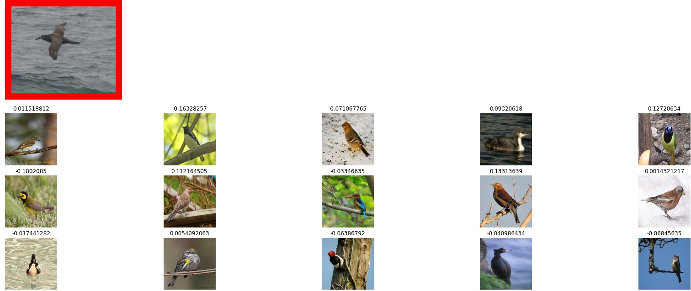

## 4. Image Similarity

This project is based on research paper name [Classification is a Strong Baseline for Deep Metric Learning](https://arxiv.org/abs/1811.12649?utm_source=feedburner&utm_medium=feed&utm_campaign=Feed%253A+arxiv%252FQSXk+%2528ExcitingAds%2521+cs+updates+on+arXiv.org%2529).This paper shows the effectiveness of classification based approaches on image retrieval datasets.

### **Points to note:**

* For effective training we make sure that every mini batch contains same amount of classes for per batch, in case of `CUB-200` ,we will use 75 image per mini batch with 25 images for per classes(3 classes per batch).

* We will use custom `NormSoftmax` loss function as author of the paper suggests.
* We will use `Layer normalization` just before softmax activation layer.

